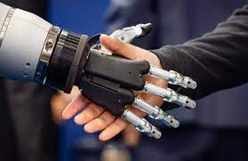

# Tecnologias inteligentes para a definição de sucesso de futuras startup : uma avaliação crítica

## Lia Mariana N.Brito - Engenheira de Software

- KNN
- LGBM

  As startups vêm se tornando um grande queridinho dentro do mundo empreendedor. Segundo a revista Forbes existem empresas com faturamento de 1 bilhão de dólares, mas para alcançar essa trilha de sucesso existem diversos pontos para se suprir. O estudo tem como objetivo explorar de forma crítica, quantitativa e bibiliografica de como as tecnologias inteligentes(TIAP) podem se tornar fatores determinantes para o sucesso de startups, tais como Inteligência Artificial (IA),Machine Learning (MN) e Deep Learning (DL), e técnicas de estudos de cenários e tomadas de decisões apoiadas (como a Business Intelligence- BI) .
